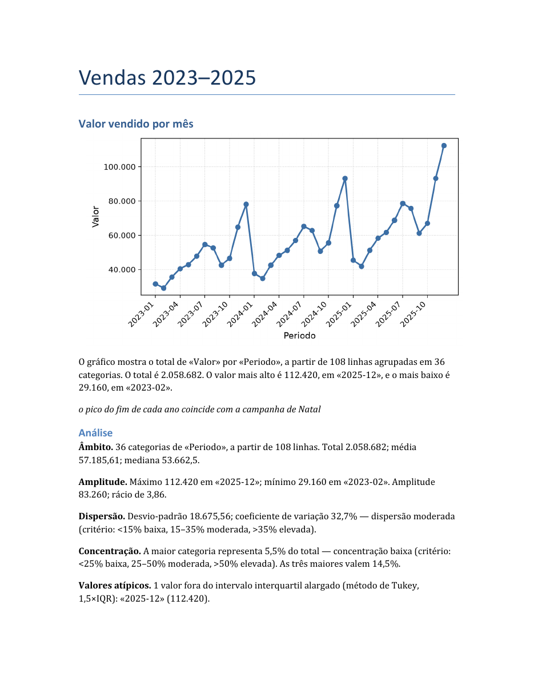

# excel-para-word

Transforma um ficheiro Excel num relatório Word com gráficos e uma descrição
factual de cada um. É uma [skill do Claude Code](https://docs.claude.com/en/docs/claude-code):
descreves em português o que queres, e o Claude lê a folha de cálculo, escreve o
plano, verifica os dados e gera o documento.

> **In English —** A Claude Code skill that turns an Excel file into a Word report.
> You describe the charts you want in plain language; it reads the spreadsheet,
> checks the data, draws the charts and writes a factual description of each one
> using numbers computed from the file itself. It refuses to generate the report
> when it finds problems in the data, unless you explicitly accept them.



## O que faz, e o que não faz

**Faz:**

- Lê `.xlsx`, com uma ou mais folhas.
- Desenha gráficos de **barras**, **linhas** e **circular**.
- Agrega por **soma**, **média** ou **contagem**.
- Escreve, por baixo de cada gráfico, uma frase com o total, o valor mais alto e
  o mais baixo — números calculados a partir da mesma conta que desenhou o gráfico.
- Junta a tabela de dados, se pedires.
- **Recusa gerar o relatório** quando encontra problemas nos dados, até tu dizeres
  que os aceitas.

**Não faz, de propósito:**

- Não lê CSV, `.xls` nem `.xlsm`.
- Não escreve recomendações, causas nem previsões. Só descreve.
- Não inventa dados nem preenche células vazias em silêncio.
- Não altera o ficheiro Excel de origem.

## Instalação

Precisas de saber abrir um terminal. Se nunca abriste, esta ferramenta ainda não
é para ti — o relatório de exemplo em `exemplos/` mostra o resultado sem instalar
nada.

```bash
git clone https://github.com/Vascobranco2509/excel-para-word.git
cd excel-para-word
pip install -r requirements.txt
```

Precisas de Python 3.10 ou mais recente.

Para usar como skill do Claude Code, copia a pasta para `~/.claude/skills/`.

## Exemplo

O repositório traz um exemplo completo. Para o repetir:

```bash
python scripts/gerar_relatorio.py \
  --dados exemplos/vendas_2025.xlsx \
  --plano exemplos/plano.json \
  --saida relatorio.docx
```

## Comandos

```bash
# ver os problemas dos dados sem gerar nada
python scripts/gerar_relatorio.py --dados X.xlsx --plano plano.json --verificar

# gerar o relatório
python scripts/gerar_relatorio.py --dados X.xlsx --plano plano.json --saida r.docx

# gerar mesmo havendo avisos, depois de os teres lido
python scripts/gerar_relatorio.py --dados X.xlsx --plano plano.json --saida r.docx --avisos-aceites
```

Códigos de saída: `0` correu bem, `1` erro nos dados, `2` bloqueado por avisos.

## Campos do `plano.json`

Esta é a referência única. O `SKILL.md` aponta para aqui e não a repete.

```json
{
  "titulo_relatorio": "Vendas 2025",
  "graficos": [
    {
      "tipo": "barras",
      "folha": "Vendas",
      "eixo_x": "Mes",
      "eixo_y": "Valor",
      "agregacao": "soma",
      "titulo": "Valor vendido por mês",
      "nota": "campanha de fim de ano",
      "tabela_dados": true
    }
  ]
}
```

| Campo | Obrigatório | O que é |
|---|---|---|
| `titulo_relatorio` | sim | Título na primeira página do documento. |
| `graficos` | sim | Lista de gráficos. Um gráfico por página. |
| `tipo` | sim | `barras`, `linhas` ou `circular`. |
| `folha` | sim | Nome da folha do Excel. |
| `eixo_x` | sim | Coluna que dá as categorias (meses, canais, regiões…). |
| `eixo_y` | sim, exceto em `contagem` | Coluna com os números. |
| `agregacao` | sim | `soma`, `media` ou `contagem`. |
| `titulo` | sim | Título do gráfico, no Word. Não entra na imagem. |
| `nota` | não | Frase de enquadramento, **sem números**. Fica em itálico por baixo da descrição. |
| `tabela_dados` | não | `true` acrescenta a tabela por baixo do gráfico. Acima de 30 categorias mostra as primeiras 30 e diz quantas ficaram de fora. |

Qualquer campo que não esteja nesta tabela é recusado com erro. É de propósito:
apanha planos escritos contra uma versão antiga.

### Duas decisões que valem a pena explicar

**Números guardados como texto são convertidos, mas só quando é seguro.**
`1.250,00 €` e `$1,250.00` são lidos corretamente, e a convenção é deduzida dos
valores da própria coluna: se lá estiver um `980,50`, fica provado que a vírgula
é decimal. Quando nada o prova — uma coluna só com `1.250` e `2.500` — para com
erro em vez de adivinhar, porque `1.250` tanto pode ser mil duzentos e cinquenta
como um vírgula vinte e cinco, e um palpite errado dá um relatório mil vezes ao
lado com ar perfeitamente normal.

**A ordem das categorias é a ordem do ficheiro, não a alfabética.** Se a tua
coluna tem os meses por ordem, o gráfico sai por ordem. Ordenar por alfabeto
poria Abril antes de Janeiro e daria uma série temporal errada.

**O campo `nota` não aceita números.** Os números do relatório saem sempre dos
dados. Se a nota pudesse ter números escritos à mão, bastava mudar o Excel e não
refazer o plano para o texto passar a desmentir o gráfico ao lado.

## Quando é que se recusa a gerar

O script analisa sempre os dados antes de gerar. Se encontrar algum destes casos,
**não gera nada** e explica porquê:

- uma categoria que parece ser a **linha de totais** da folha (`TOTAL`, `Soma`,
  `Total Geral`, ou a última categoria a valer exatamente a soma das outras) —
  se passasse, o gráfico contaria os mesmos valores duas vezes;
- linhas com células vazias nas colunas usadas;
- coluna numérica guardada como texto no Excel;
- colunas sem cabeçalho na folha (células soltas ao lado da tabela);
- gráfico circular com mais de 12 fatias;
- tabela de dados com mais de 30 categorias.

Lês os avisos e, se estiverem entendidos, repetes com `--avisos-aceites`. Todos
eles ficam registados na secção «Notas sobre os dados», no fim do documento.

Casos mais graves param mesmo, sem hipótese de contornar: folha ou coluna que não
existe, coluna sem números nenhuns, gráfico circular com valores negativos,
ficheiro que não é `.xlsx`, ficheiro aberto no Excel.

## Testes

```bash
python -m pytest testes/ -v
```

Os testes usam ficheiros propositadamente sujos: texto onde deviam estar números,
células vazias, meses fora de ordem alfabética, folhas que não existem, caminhos
com espaços e acentos.

## Versões testadas

pandas 3.0.5 · openpyxl 3.1.5 · matplotlib 3.11.1 · python-docx 1.2.0 ·
pytest 9.1.1 · Python 3.14.6 em Windows 11.

## Licença

MIT — ver [LICENSE](LICENSE).
